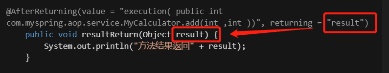
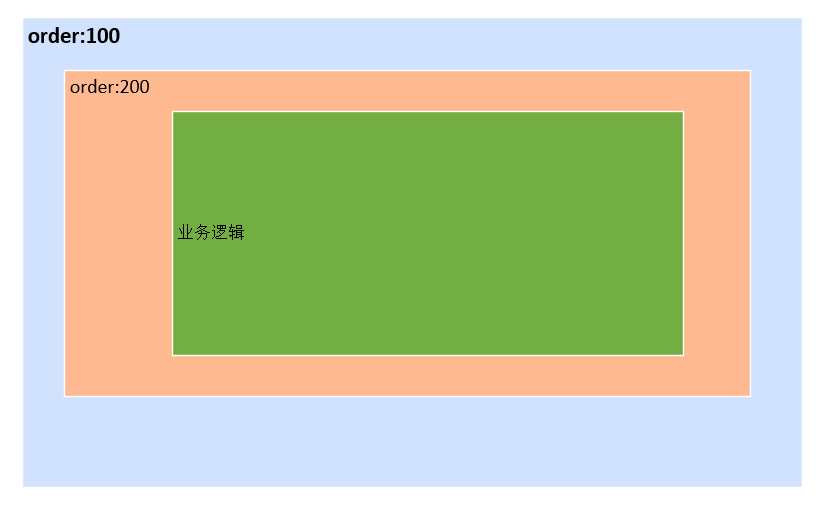

<!-- TOC -->

- [1. Spring AOP的使用](#1-spring-aop的使用)
    - [1.1. 为什么需要AOP?](#11-为什么需要aop)
    - [1.2. 动态代理](#12-动态代理)
        - [1.2.1. 动态代理的两种方式](#121-动态代理的两种方式)
        - [1.2.2. 自己手写动态代理](#122-自己手写动态代理)
    - [1.3. AOP的相关概念](#13-aop的相关概念)
    - [1.4. AOP的通知类型](#14-aop的通知类型)
    - [1.5. AOP的应用场景](#15-aop的应用场景)
    - [1.6. AOP实现方式](#16-aop实现方式)
    - [1.7. 使用Spring AOP实际操作](#17-使用spring-aop实际操作)
    - [1.8. 通知类型@Around 环绕通知](#18-通知类型around-环绕通知)
    - [1.9. Spring AOP 对比 自己写的动态代理](#19-spring-aop-对比-自己写的动态代理)
- [2. 深入SpringAOP-注解使用](#2-深入springaop-注解使用)
    - [2.1. 切入点表达式](#21-切入点表达式)
        - [2.1.1. 表达式通配符](#211-表达式通配符)
        - [2.1.2. 表达式支持逻辑运算符](#212-表达式支持逻辑运算符)
    - [2.2. 获得方法及返回信息](#22-获得方法及返回信息)
        - [2.2.1. 通过JoinPoint获取方法信息（方法参数、方法名等）](#221-通过joinpoint获取方法信息方法参数方法名等)
        - [2.2.2. 通过@AfterReturning注解的returning参数，获取结果](#222-通过afterreturning注解的returning参数获取结果)
        - [2.2.3. 通过@AfterThrowing注解的 throwing 参数获取抛出的异常](#223-通过afterthrowing注解的-throwing-参数获取抛出的异常)
        - [2.2.4. ？？？在参数列表新增其他自定义参数？？？](#224-在参数列表新增其他自定义参数)
        - [2.2.5. 通知方法定义时的特殊要求](#225-通知方法定义时的特殊要求)
        - [2.2.6. 切入点表达式的抽象-@Pointcut注解](#226-切入点表达式的抽象-pointcut注解)
    - [2.3. 多个切面类的顺序-@Order注解](#23-多个切面类的顺序-order注解)
- [3. 深入SpringAOP-xml配置文件使用](#3-深入springaop-xml配置文件使用)
    - [3.1. xml配置使用方式](#31-xml配置使用方式)
- [4. AOP事务](#4-aop事务)
    - [4.1. demo](#41-demo)
        - [4.1.1. 引入的pom](#411-引入的pom)
        - [4.1.2. java template好处](#412-java-template好处)
    - [4.2. 事务的特性](#42-事务的特性)
    - [4.3. 编程式事务VS声明式事务](#43-编程式事务vs声明式事务)
    - [4.4. @Transactional实际使用](#44-transactional实际使用)
        - [4.4.1. xml中引入事务管理器](#441-xml中引入事务管理器)
        - [4.4.2. 使用try catch](#442-使用try-catch)
        - [4.4.3. @Transactional注解的属性](#443-transactional注解的属性)
        - [数据库的隔离级别](#数据库的隔离级别)
        - [传播特性](#传播特性)
- [5. 常见问题](#5-常见问题)
    - [5.1. 报错找不到合适的bean](#51-报错找不到合适的bean)
    - [5.2. MySQL的POM版本](#52-mysql的pom版本)
- [待解决问题](#待解决问题)

<!-- /TOC -->

# 1. Spring AOP的使用

## 1.1. 为什么需要AOP?

从一个场景出发：如果说一个完整项目前期并没有做日志的记录，后期需要添加日志记录时，如果一个一个方法来加日志记录的代码，这明显是一个很大的问题。<br>
此时，如果能有办法把日志记录作为一个模块来抽象出来，并且指定在某些方法执行时则进行日志记录

## 1.2. 动态代理

### 1.2.1. 动态代理的两种方式

* JDK提供的通过接口
* cglib

### 1.2.2. 自己手写动态代理

练习代码见工程，手写动态代理的目的是理解比起传统的方式，“动态代理”方式的好处：可以模块化、解耦业务代码和其他处理（比如日志），此时可以初见AOP思想的雏形：比起传统方式，使用动态代理的方式可以
解耦合、降低代码量、降低维护成本、更灵活的调整代码
**而Spring强大的地方在于，不需要自己写动态代理，只需要使用注解就能实现，过程变的更加的简单；Spring AOP的底层实现也依赖的是动态代理
**

## 1.3. AOP的相关概念

* 通知/增强（Advice）:或者叫“增强处理”，指的就是添加到切点的**一段逻辑代码**，一般作为增强的功能，比如日志、事务处理；以及*
  *执行的时机（也叫通知类型）**，**简单讲就是：定义干什么+什么时候干** <br>通知类型一般有：

```
    Before 在方法被调用之前调用
    After 在方法完成后调用通知，无论方法是否执行成功
    After-returning 在方法成功执行之后调用通知
    After-throwing 在方法抛出异常后调用通知
    Around 环绕
```

* 连接点（Join point）:**允许进行“通知/增强”的地方**（就是在哪里可以允许执行增强逻辑），从通知类型可以得知，方法执行前、执行后、返回值时、环绕、异常时都可以作为
  “连接点”。AspectJ还可以让你在构造器或属性注入时都行，不过一般情况下不会这么做，可以说，和方法有关的前前后后都是连接点

* 切点、切入点（Pointcut）:“连接点”会有很多个，但是并不是每一个我们都希望去做“增强/通知”，而切点的目的，就是在于*
  *定义哪些方法需要做增强/通知**，切点是连接点的子集；**简单讲就是：定义在哪干**
  比如说你只是想让其中几个，在调用这几个方法之前、之后或者抛出异常时干点什么，那么就用切入点来定义这几个方法，让切点来筛选连接点，选中那几个你想要的方法。

* 切面（Aspect）:**“通知/增强”+“切入点”的结合**，横切关注点的模块化，比如“日志处理”、“事务处理”都是不同的横切关注点的模块化，不同的切面
  *
  *一般单独作为一个类。通知和切点共同定义了关于切面的全部内容：通知说明了干什么和什么时候干（什么时候通过before，after，around等AOP注解就能知道），而切入点说明了在哪干（指定到底是哪个方法），这就是一个完整的切面定义。
  **

* 切入、引入（Introduction）:
* 目标对象（Target Object）:**被代理对象，被一个或多个切面通知的对象**
* AOP代理（AOP Proxy）:**AOP框架创建的代理对象**，用来实现切面契约（aspect
  contract）（包括通知方法执行等功能）。在Spring中，AOP代理可以是JDK动态代理或CGLIB代理。
* 织入（Weaving）：**将增强/通知添加到目标类的具体连接点上的过程，即把切面应用到目标对象来创建新的代理对象的过程**
  。也可以在运行时完成。Spring和其他纯Java AOP框架一样，在运行时完成织入。

## 1.4. AOP的通知类型

after和afterReturning的区别：
after是目标方法执行完自后；afterReturning是目标方法返回值之后。
afterReturning比after执行更晚

## 1.5. AOP的应用场景

* 日志管理
* 权限认证
* 安全检查
* 事务管理（事务控制/事务记录）

## 1.6. AOP实现方式

* AOP本身仅仅只是个概念，真正要实现它，我们需要一些工具和库来完成
* 实现AOP的工具和库有：
    + **AspectJ(Spring中最常用)**: 一个 JavaTM 语言的面向切面编程的无缝扩展
    + DexMaker: Dalvik 虚拟机上，在编译期或者运行时生成代码的 Java API
    + ASMDEX: 一个类似 ASM 的字节码操作库

## 1.7. 使用Spring AOP实际操作

1. 依赖pom.xml导入
2. properties配置文件打开<aop:aspectj-autoproxy>配置
    ```xml
     <!--重要，重要，重要！！！开启aop的注解功能-->
    <aop:aspectj-autoproxy></aop:aspectj-autoproxy>
    ```
3. 将service、controller、repository等注解配置在所需的类中，将这些java bean添加至Spring容器
    ```java
    @Service
    public class MyCalculator implements ICalculator {
        //实现方法xxx
    }
    ```
4. 找到切面类，在切面类中加入@Aspect @Component标签，aspect标签代表切面类，
   component标签设置让本切面类也能让Spring扫描到
    ```java
    @Aspect
    @Component
    public class LogUtil {
        //切面类
    }
    ```
5. 在切面方法上设置通知类型
    * @Before
    * @After
    * @AfterReturning
    * @AfterThrowing
    * @Around 环绕，相当于包含以上所有的步骤

    ```java
    @Aspect
    @Component
    public class LogUtil {

        @Before(value = "execution( public int com.myspring.aop.service.MyCalculator.add(int , int ))")
        public void start() {
            System.out.println("方法执行");
        }

        @After(value = "execution( public int com.myspring.aop.service.MyCalculator.add(int ,int ))")
        public void stop() {
            System.out.println("方法执行结束....................");
        }

        @AfterThrowing(value = "execution( public int com.myspring.aop.service.MyCalculator.add(int ,int ))")
        public void exceptionThrow() {
            System.out.println("方法捕获异常");
        }

        @AfterReturning(value = "execution( public int com.myspring.aop.service.MyCalculator.add(int ,int ))")
        public void resultReturn() {
            System.out.println("方法结果返回");
        }
    }
    
    ```
6. 通知类型的执行顺序

* 不报错的情况下：
  @Before --> @After --> @AfterReturning <br>
* 报错的情况下：
  @Before --> @After --> @AfterThrowing

* @Around比较特殊，相当于包含以上所有的步骤；而环绕通知，会比以上通知类型更早执行
  可以这么理解：
  环绕前置-->普通前置-->目标方法执行-->环绕正常结束/出现异常-->环绕后置-->普通后置-->普通返回或者异常。

但是需要注意的是，如果出现了异常，那么环绕通知会处理或者捕获异常，普通异常通知是接收不到的，因此最好的方式是在环绕异常通知中向外抛出异常。

## 1.8. 通知类型@Around 环绕通知

@Around和其他几个通知类型有一些差异，更像是我们自己写的动态代理的方法，功能最强大：可以在invoke反射调用的前后，自己做很多的调用
比如：

## 1.9. Spring AOP 对比 自己写的动态代理

使用Spring AOP 的话，代码量非常的少，因为本身复杂的动态代理逻辑都封装在框架内了，实际上客户端代码只是做了注解和配置

# 2. 深入SpringAOP-注解使用

* 注意，Spring本身会判断：
    + 被代理类如果能找到实现的接口，是按照JDK提供的动态代理实现AOP；
    + 如果没有接口实现，用的是cglib实现AOP
* JDK提供的动态代理和cglib性能的区别，早起是cglib性能更好一些，后来JDK提供的动态代理经过比较多的更新，目前二者效率差不多

## 2.1. 切入点表达式

**execution(访问修饰符 返回类型 方法完全限定名(方法形参的数据类型))**

```java
@Before(value = "execution( public int com.myspring.aop.service.MyCalculator.add(int , int ))")
```

### 2.1.1. 表达式通配符

* *可以匹配一个或多个字符
    + 放在全限定名中匹配一个或多个字符
    + 放在参数中匹配任意一个参数
    ```java
    @Before(value = "execution( public int com.myspring.aop.service.MyCalculator.add(* , int ))")
    ```
    + 只能匹配一层路径，如果项目路径下有多层目录，那么 *只能匹配一层路径
    + 权限位置不能使用*，如果想表示全部权限，那么不写即可
    ```java
    @Before(value = "execution( int com.myspring.aop.service.MyCalculator.add(* , int ))")
    ```

​

* ..可以匹配**多个参数**（有点java的可变参数...符号的意思）
    + 放在参数列表中，可以匹配多个参数，任意数据类型
    ```java
    @Before(value = "execution( int com.myspring.aop.service.MyCalculator.add(.. ))")
    ```

    + 放在方法全限定名，可以匹配多层路径
    ```java
    @Before(value = "execution( int com..MyCalculator.add(.. ))")
    ```

### 2.1.2. 表达式支持逻辑运算符

表达式可以用&&、||、！的方式<br>

```java
    @Before(value = "execution( int com..MyCalculator.add(.. )) || execution(int com..MyCalculator.sub(.. )) ")
```

## 2.2. 获得方法及返回信息

### 2.2.1. 通过JoinPoint获取方法信息（方法参数、方法名等）

在自己编写动态代理的时候，方法详细信息：方法名称和方法参数等需要我们通过反射机制来拿到。在Spring中，需要通过**JoinPoint对象
**来拿到，**且此参数必须是参数列表第一个**

```java
@Before(value = "execution( int com..MyCalculator.add(.. )) || execution(int com..MyCalculator.sub(.. )) ")
    public void start(JoinPoint joinPoint) {//重要，通过JoinPoint对象可以拿到方法相关信息
        //通过JoinPoint获取方法名称
        String methodName = joinPoint.getSignature().getName();
        //童工JoinPoint获取方法参数
        Object[] methodArgs = joinPoint.getArgs();
        System.out.println(methodName + "方法执行,参数为：" + Arrays.asList(methodArgs));
    }
```

### 2.2.2. 通过@AfterReturning注解的returning参数，获取结果

```java
@AfterReturning(value = "execution( public int com.myspring.aop.service.MyCalculator.add(int ,int ))", returning = "result")
    public void resultReturn(Object result) {
        System.out.println("方法结果返回" + result);
    }
```

注意点：

* 必须是@AfterReturning注解，其他注解内部未定义返回returning参数，因为只有AfterReturning才能确认一定有返回值
* 定义返回returning参数，这个参数名称需要和方法形参对应
  

### 2.2.3. 通过@AfterThrowing注解的 throwing 参数获取抛出的异常

```java
@AfterThrowing(value = "execution( public int com.myspring.aop.service.MyCalculator.*(..))", throwing = "exception")
    public void exceptionThrow(Exception exception) {
        System.out.println("方法捕获异常" + exception);
    }
```

注意点：

* 必须是@AfterThrowing注解，其他注解内部未定义返回throwing参数，因为只有AfterThrowing才进行异常的处理

```h
//AOP官网参考地址
https://docs.spring.io/spring-framework/docs/current/reference/html/core.html#aop-at-aspectj
```

### 2.2.4. ？？？在参数列表新增其他自定义参数？？？

### 2.2.5. 通知方法定义时的特殊要求

* 访问修饰符、是否静态方法、是否有返回值、返回值类型，对于通知方法的定义都没影响，不影响AOP功能正常使用

```java
private int start(JoinPoint joinPoint) {//修改访问修饰符和返回值的目的，是测试通知方法定义时对这些是否有要求

return 100;//修改访问修饰符和返回值的目的，是测试通知方法定义时对这些是否有要求
```

* 通知方法对于参数是要求较多的，不能随便加，需要和argName参数等一起使用并且映射正确才可以

### 2.2.6. 切入点表达式的抽象-@Pointcut注解

通知方法比较多的时候，每一个方法上都要单独写一个完整的切入点表达式，太多了，而且修改起来很麻烦。如果可以像一个变量一样定义好，其他地方直接引用就好了，所以切入点表达式本身提供了抽象的功能

```java
    //此处通过@Pointcut注解定义表达式的抽象，相当于一个变量，大家应用这个变量就能拿到定义的表达式。
    // 而方法名就是这个变量
    @Pointcut(value = "execution( int com..MyCalculator.add(.. )) || execution(int com..MyCalculator.sub(.. ))")
    public void pointExpression(){
        //此处可以什么都不写，定义一个没有返回值的空方法
        //只是起了一个声明的作用，其实写什么也都没用
    }
```

```java
    @Before(value = "pointExpression()") //通知方法使用引用定义的表达式的抽象，来获取表达式
    private void start(JoinPoint joinPoint) {}
```

## 2.3. 多个切面类的顺序-@Order注解

* 默认是按照类名的首字母排序，按照字典序;第一个字母一样就比第二个字母，依此类推
* 如果需要人为自定义，可以使用@Order注解来定义，数字越小执行越靠外部
  

# 3. 深入SpringAOP-xml配置文件使用

## 3.1. xml配置使用方式

# 4. AOP事务

## 4.1. demo

### 4.1.1. 引入的pom

### 4.1.2. java template好处

## 4.2. 事务的特性

* 原子性 事务是数据库的逻辑工作单位，它对数据库的修改操作**为一个整体，不可分割**：要么全不执行，要么都执行成功
* 一致性 官网上事务一致性的概念是：事务必须使数据库从一个一致性状态变换到另外一个一致性状态。换一种方式理解就是：*
  *事务按照预期生效，所有的数据的状态是预期一致的、正确的状态**。
    + 举例说明：张三向李四转100元，转账前和转账后的数据是正确的状态，这就叫一致性，如果出现张三转出100元，李四账号没有增加100元这就出现了数据错误，就没有达到一致性。
* 隔离性 多个用户**并发**访问数据库时，数据库为每个用户各自开启的事务，互相之间不能有影响，*
  *每个事务不能被其他事务的操作数据所干扰，多个并发事务之间互相隔离**
* 持久性 事务一旦被提交，该事务所对数据库所作的更改便持久的保存在数据库之中，并不会被回滚。

```
结合实际的场景示例：
一个转账操作： 张三转账给李四
如果代码正常运行的话，那么张三会扣减金额，李四会增加金额，这就确保的原子性；

一旦数据保存到数据库之后，数据就永久被改变了，这就是持久性；

事务前后，数据的状态也是我们所期望的状态，这就保证了数据的一致性；

如果在事务未commit的话，那么在另外一个线程发起查询请求的话，那么并不能查看到最近的数据（这里未进行编码），这就是隔离性。
```

## 4.3. 编程式事务VS声明式事务

* 编程式事务：**通过代码的方式定义事务的处理**
  ：基于底层的API，如PlatformTransactionManager、TransactionDefinition和TransactionTemplate等核心接口，开发者完全可以通过编程的方式进行事务管理。
  编程式事务需要开发者在代码中手动管理事务的开启、提交和回滚等操作。例如：

```java
public void test() {
    
// 开发者可以通过API自己控制事务
TransactionDefinition def = new DefaultTransactionDefinition();
TransactionStatus status = transactionManager.getTransaction(def);
try {
// 事务操作
// 事务提交
transactionManager.commit(status);
} catch (DataAccessException e) {
// 事务提交
transactionManager.rollback(status);
throw e;
}
}
```

* 声明式事务：开发者可以在配置（主要是注解、xml）的帮助下来管理事务，而不需要依赖底层API来进行编码

```java
@Transactional //这里注解就是配置声明
public void test() {
// 事务操作
}
```

## 4.4. @Transactional实际使用

### 4.4.1. xml中引入事务管理器

1. 将事务管理器TransactionManager引入Spring容器中，因为是外部对象，所以直接在xml里定义引入的bean
2. 引入TransactionManager时，声明dataSource属性

```xml
<!--1.将TransactionManager注册为SPring bean对象-->
    <bean id="transactionManager" class="org.springframework.jdbc.datasource.DataSourceTransactionManager">
        <!--2.注意此处还需要声明dataSource 属性-->
        <property name="dataSource" ref="dataSource"></property>
    </bean>
```

3. 开启基于注解的事务管理器，使@Transactional生效

```xml
<!--3.开启基于注解的事务管理器，使@Transactional生效-->
    <tx:annotation-driven transaction-manager="transactionManager"></tx:annotation-driven>
```

4. 在方法上可以直接使用@Transactional注解即可

```java
 @Transactional
public void checkout(String username,int id){
        bookDao.updateStock(id);
        int price=bookDao.getPrice(id);
        bookDao.updateBalance(username,price);
        }
```

### 4.4.2. 使用try catch

在使用try catch时，如果try块中的代码异常并被捕获，事务是否能正常处理数据？
可以，因为try catch目的就是消化异常，所以对于代码而言是继续往下执行了的

### 4.4.3. @Transactional注解的属性

@Transactional的可用属性：

1. propagation:传播特性
2. isolation: 隔离级别
3. timeout: 超时时间。单位为秒，超出设置时间后，则出异常，并回滚事务
4. readonly: 设置只读事务。开启后就是事务运行期间，数据是只读的，不允许修改数据，否则出异常
    + 适用场景：
    + a.一个事务内比如执行多次查询，查询内容相同，为了数据一致性，打开只读事务
    + b.都是查询操作，没有删除修改，也不需要删除修改，可以打开只读事务
      建议是全部都是查询的情况下开启

5. noRollbackFor: 设置哪些异常不回滚。配置具体的异常类之后，出现该异常，仍然执行完事务，不回滚数据
   noRollbackForClassName:和noRollbackFor一样，只是填写的是 异常类的完全限定名，String类型名称
   但是，和try catch类似的是，出异常的代码后面的数据处理逻辑不会执行

6. RollbackFor: 设置哪些异常才进行回滚。配置具体的异常类之后，出现该异常，才回滚数据；否则仍然执行完事务不回滚
   RollbackForClassName:和noRollbackFor一样，只是填写的是 异常类的完全限定名，String类型名称

### 数据库的隔离级别

### 传播特性

* PROPAGATION_REQUIRED: **如果不存在外层事务，就主动创建事务；否则使用外层事务**
  如果设置的传播特性是Required，那么**所有的事务都会统一成一个事务**，一旦发生错误，所有的数据都要进行回滚
* PROPAGATION_REQUIRES_NEW：总是主动开启事务（=**就是一个独立的事务**）；如果存在外层事务，就将外层事务挂起。（**执行事务时不受外层事务影响
  **）
* PROPAGATION_SUPPORTS：如果不存在外层事务，就不开启事务；否则使用外层事务（**没有外层事务就相当于不使用事务**）
* PROPAGATION_NOT_SUPPORTED：**当前不支持事务**，如果存在外层事务，就将外层事务挂起。比如ServiceA.methodA的事务级别是PROPAGATION_REQUIRED
  ，而ServiceB.methodB的事务级别是PROPAGATION_NOT_SUPPORTED
  ，那么当执行到ServiceB.methodB时，ServiceA.methodA的事务挂起，而他以非事务的状态运行完，再继续ServiceA.methodA的事务。
* PROPAGATION_NEVER：**不能在事务中运行，如果存在外层事务，则抛出异常**。假设ServiceA.methodA的事务级别是PROPAGATION_REQUIRED，
  而ServiceB.methodB的事务级别是PROPAGATION_NEVER ，那么ServiceB.methodB就要抛出异常了。
  使用场景：非事务方法，可以设置为Nerver
* PROPAGATION_MANDATORY：**必须在一个事务中运行，如果不存在外层事务，就抛出异常**；否则使用外层事务。也就是说，他只能被一个父事务调用。否则，他就要抛出异常。
*

参考：https://blog.csdn.net/lfsf802/article/details/9417095
https://juejin.cn/post/6844903938928427022

# 5. 常见问题

## 5.1. 报错找不到合适的bean

A:经常出现配置看着没什么问题但是报错找不到合适的bean，需要检查一下是不是不同的config.xml文件，代码获取applicationContext的时候需要对应好各自的xml

## 5.2. MySQL的POM版本

pom的8.X 对应的是mySQL 8的版本
pom的6.X 对应的是mySQL 5.7以上的版本
Pom的5.1 对应的是mySQL 5.7以下的版本

# 待解决问题

1. @Transactional注解，用noRollbackfor参数没什么用，而且生效的貌似是因为throw出去了异常，而不是这个参数
2. 一个大的事务方法，包含两个子事务方法，子事务都是RequiresNew，但是看起来和执行顺序有关系，如果报异常的是第一个方法，则第二个方法就不会执行，也就不会修改数据提交事务了
