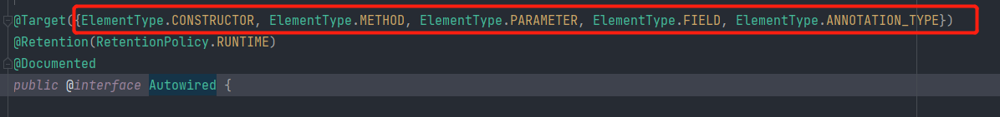
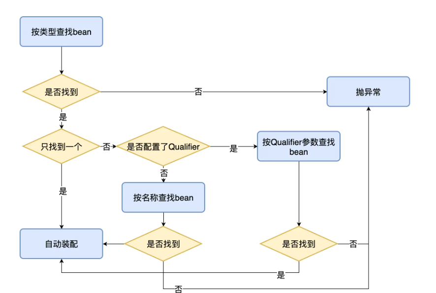
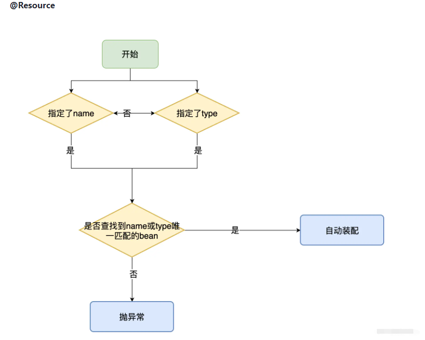
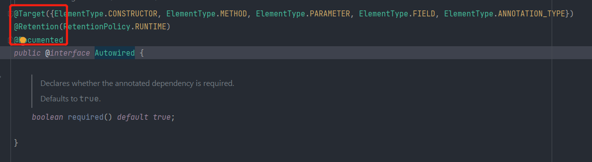

# SpringIOC注解使用
<!-- TOC -->

- [SpringIOC注解使用](#springioc注解使用)
    - [一、注解方式注册bean](#一注解方式注册bean)
        - [1.4个常用注解](#14个常用注解)
        - [2.使用方式](#2使用方式)
        - [3.其他注解说明](#3其他注解说明)
        - [4.xml VS 注解](#4xml-vs-注解)
        - [5.context filter使用](#5context-filter使用)
        - [6.@AutoWired注解：自动装配，自动注入](#6autowired注解自动装配自动注入)
            - [1. 为什么需要自动注入？](#1-为什么需要自动注入)
            - [2. 自动装配的规则](#2-自动装配的规则)
            - [3. @AutoWired注解的作用域](#3-autowired注解的作用域)
            - [4. @Qualifier注解 <br>](#4-qualifier注解-br)
            - [5. @Autowired VS @Resource](#5-autowired-vs-resource)
        - [7. 泛型依赖注入](#7-泛型依赖注入)
        - [8.元注解](#8元注解)

<!-- /TOC -->

## 一、注解方式注册bean
### 1.4个常用注解
* @Controller：控制器，推荐给controller层添加此注解
* @Service：业务逻辑，推荐给service层添加此注解
* @Repository：仓库，推荐给数据访问层添加此注解
* @Component：组件，通用注解
* 注意：我们虽然人为的给不同的层添加不同的注解，但是在spring看来，可以在任意层添加任意注解
  ** 举个例子，就像类名起名要用驼峰标识一样，不这么写也可以，语法是通的过的，但是作为书写标准以及可读性，尽可能分开 **

      spring底层是不会给具体的层次验证注解，这样写的目的只是为了提高可读性，最偷懒最简单的方式
      就是给所有想交由IOC容器管理的bean对象添加component注解

  Q:给各个类添加完注解后，用代码获取bean时，报错 No bean named 'XXX' available,原因是什么？</br>
  A:没有进行配置项定义spring需要扫描哪些包，需要在Spring配置xml文件里添加 <<context:component-scan>> 标签
  <br></br>

### 2.使用方式
1. 在相应的类中添加注解
2. 在配置xml文件中添加<<context:component-scan>>标签,目的是配置定义spring需要扫描哪些包
此时，bean对象就已经成功注册在Spring容器中了。
3. 注：实际上，在添加<<context:component-scan>>标签前，还需要在配置xml中导入context命名空间.一般IDE会自动帮我们添加了

```
    Q：注解的方式，哪怕注解没有指定id，仍然可以通过bean的id和class获取bean对象，Spring是如何获取到bean id的呢？</br>
    A: 默认是按照<mark>**当前类的类名首字母小写，来作为bean id的**</mark>   
```

4. @Controller(**value=“xx”**) 通过value参数修改bean id
在注解如@Controller后面加参数，如@Controller(value="NewId") </br>
注：不知道注解参数有哪些怎么办？ctrl点击注解，打开注解类，可以看到注解类支持的参数有哪些。
比如下图，支持value参数，且默认为“”

默认是按照<mark>**当前类的类名首字母小写，来作为bean id的**</mark>  
<br></br>


### 3.其他注解说明


1. @Scope注解：如果不设置，IOC容器里的bean对象默认都是单例的</br>
单例：单实例，简单讲就是同一个实例化的对象，就是只new了一个，其他地方要用都是这里同一个对象的地址引用</br>
验证测试:
```java
    PersonService personService = context.getBean("personService", PersonService.class);
    PersonService personService1 = context.getBean("personService", PersonService.class);
    System.out.println(personService);
    System.out.println(personService==personService1);//默认单例模式下，返回结果应该为true
```
@Scope注解可以控制作用域：可设置“Singleton”单例、"Prototype"多例 两种作用域.多例就是多个对象了，每次取的都是新new的对象
<br></br>

### 4.xml VS 注解
xml优点：完整，配置功能强大
xml缺点：繁杂，而且都是铺在一个xml文件里，不利于维护

注解优点：1.快捷，便于使用； 2.哪里用到就配在哪里，清晰明了
注解缺点：功能没有xml强大完整

**xml和注解同时配置，xml优先级比注解高** <br>
**一般使用其实是 XML + 注解一起配合使用的**
<br></br>

### 5.context filter使用
1. 如何通过过滤器定义哪些包扫描，那些包不被Spring扫描？
在xml配置中，<<context:component-scan>>标签中使用include-filter与exclude-filter
```xml
  <context:component-scan base-package="com.myspring">
      <context:include-filter type="指定过滤的规则" expression="表达式"/>
      <context:exclude-filter type="指定过滤的规则" expression="表达式"/>
  </context:component-scan>
```

2. type（指定过滤的规则）中包含以下类型：
* assignable
  + 和exclude-filter一起使用，指定排除具体的某个类。<mark>必须写类的完全限定名，不能写*，不能只写到包，必须是完整类名</mark>  
* annotation
  + 和exclude-filter一起使用，指定排除哪个注解，expression写的是注解的全类名
* aspectj
  + 使用切面的方式，使用场景比较少 
* custom
  + 使用自定义的方式，使用场景比较少
* regex
  + 正则表达式

3. 使用频率
* include-filter使用的较少，因为一般都是在<context:component-scan base-package="com.myspring">就已经把需要扫描的内容包含进来了
**如果项目工程引入的第三方包中包含注解，此时就需要此标签进行标识** <br>
* exclude-filer用的多一些
<br></br>

### 6.@AutoWired注解：自动装配，自动注入
#### 1. 为什么需要自动注入？
在Spring中，bean对象（包括所有用到的依赖对象）的创建是交由Spring容器来进行的，也就是IOC控制反转。
比起手动在配置文件里进行bean的装配，自动装配的功能更加的快捷强大

#### 2. 自动装配的规则
* **首先，默认是ByType（即通过类Class来查找的）查找**
* 若在容器中只找到一个匹配的bean对象，直接赋值
* 若在容器中找到了多个匹配的bean对象，再拿到变量名，根据ById的方式进一步查找
  + 匹配到唯一的bean对象，赋值
  + 匹配不到唯一的bean对象，或者匹配到多个，报异常
* 若在容器中未匹配到，报异常

#### 3. @AutoWired注解的作用域
@AutoWired注解它的作用域，或者通俗的说这个注解可以写在哪？
  * 成员变量
    + 最常用的方式，在拥有依赖对象的时候，直接把@AutoWired设置在成员变量上
  * 构造器
  * 方法
    + 在方法上配置，功能是创建对象时，就执行此方法（并且如果方法里有依赖对象，也会自动装配）
  * 参数
  * 注解类型 <br>
  可以点进去@AutoWired中看能写在什么地方


#### 4. @Qualifier注解 <br>
作用：Spring查找Bean对象ByType的基础上，加入Id的条件，而@Qualifier的参数值就是id
和@AutoWired搭配使用 <br>
场景：在ByType的基础上，还需要用Id去查找某个bean，**且设置不用变量名作为查找bean对象时的bean id条件**
```java
     /**
     * 已知：AnimalService 使用byType方式，会找到两个bean对象（DogService继承了AnimalService）
     * 所以Spring容器会拿到变量名按照ById接着去查找，此时并没有AnimalServiceQualifierTest 这个id的bean
     * 所以会报错
     * 但是如果加上@Qualifier("animalService")
     * Spring容器会拿到@Qualifier("animalService")参数名按照ById接着去查找
     * 而且经测试的结果来看，执行过程是，
     * 1.AnimalService 使用byType方式加id的方式查找
     * Spring容器会拿到@Qualifier("animalService")参数名作为Id
     * */
    @Autowired
    @Qualifier("animalService")
    private AnimalService AnimalServiceQualifierTest;
```
使用@Qualifier注解之后的执行步骤：<br>
* Spring容器使用byType方式+Id的方式查找bean对象
* Type还是类，Id就是@Qualifier("animalService")参数名作为Id

#### 5. @Autowired VS @Resource
Autowired执行过程：


Resource执行过程：


* 1.Autowired和Resource都可以用来在Spring生态里做Bean的依赖注入
* 2.来源有差异，Autowired是Spring框架本身提供的一个注解；而Resource是JDK提供的注解，JSR250规范中定义的注解（只是SPring在实现上提供了这种JSR250注解功能的支持）
* 3.Autowired默认是ByType根据类型来进行Bean的匹配
  + 若在容器中只找到一个匹配的bean对象，直接赋值
  + 若在容器中找到了多个匹配的bean对象，再拿到变量名，根据ById的方式进一步查找
  + 匹配到唯一的bean对象，赋值
  + 匹配不到唯一的bean对象，或者匹配到多个，报异常
（Autowired里有一个Required属性，决定是否打开自动装配，默认是true打开。）


  Resource支持ByType与ByName，默认是根据ByName,可以通过参数调整
    + 如果配置了ByName则按照Name查找；如果是配置了ByType则按照Type查找
    + 如果都没配置，默认按照Name查找
    + 没找到则抛异常

* 4.使用上的差异，在需要用名称匹配Bean的时候。
Resource支持ByType与ByName，默认MyName，可以通过修改参数定义;
而Autowired并且如果要进行名称的匹配，默认根据变量名匹配，自定义的话则需要配合使用@Qualifier、@Primary注解实现
* 5.基于两个注解来源不同，扩展性也有区别。Autowired只能用在Spring里，但是Resource可以用在大部分类库中

### 7. 泛型依赖注入
这部分以Demo代码为主<br>
Spring 4.0版本中更新了很多新功能，其中比较重要的一个就是对带泛型的Bean进行依赖注入的支持。
泛型依赖注入允许我们在使用spring进行依赖注入的同时，利用泛型的优点对代码进行精简，同时在不增加代码的情况下增加代码的复用性。
Spring默认按照字段的类进行依赖注入，而Spring4的新特性就是把泛型的具体类型也作为类的一种分类方法（Qualifier）。<br>
好处：
* 代码精简
* 核心逻辑解耦，提高复用性、扩展性

### 8.元注解
元注解：JDK提供的注解，4个标准的用来对注解类型进行注解的注解类。<br>
比如Spring本身定义了很多注解，这些Spring提供的注解上，都会有使用到元注解
<br>
场景：我们可以使用这4个元注解来对我们自定义的注解类型进行注解,比如公司需要封装新的框架，可能会用到；Spring框架也是一个典型
